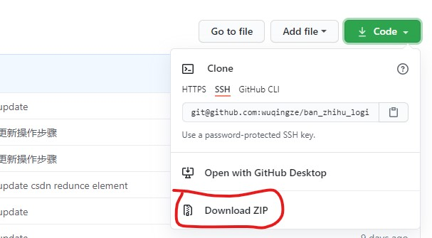
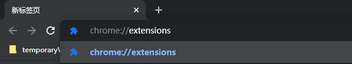
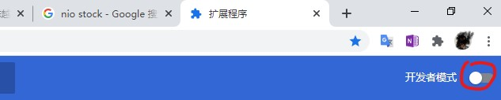
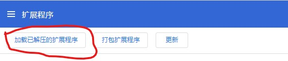
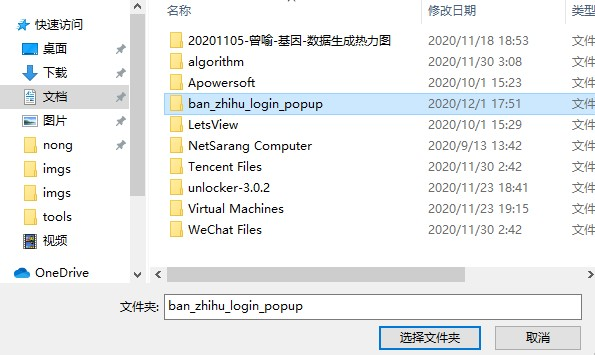
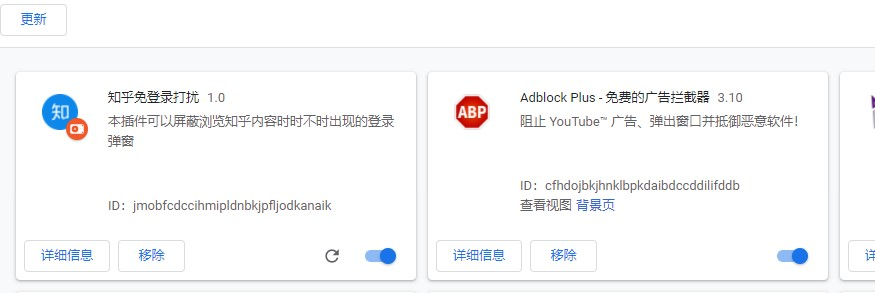

### 介绍
-------------------------
网页版知乎有一个非常烦人的地方，在不登陆情况下浏览知乎内容，时不时会有登录弹窗出来，
本插件提供屏蔽登录弹窗的功能，不需要每次手动点击关闭弹窗。

--- 更新删除csdn强制登陆窗口
--- 2020/11/22 更新删除csdn强制登陆窗口

### quick start
1. 下载本插件文件，建议直接下载zip压缩包，解压保存

2. 在浏览器地址栏输入`chrome://extensions`

3. 选择`开发者模式`

4. 选择`加载已解压的扩展程序`

5. 选择插件文件

6. 大功告成，浏览知乎内容时就不用被登录弹窗打扰了 

